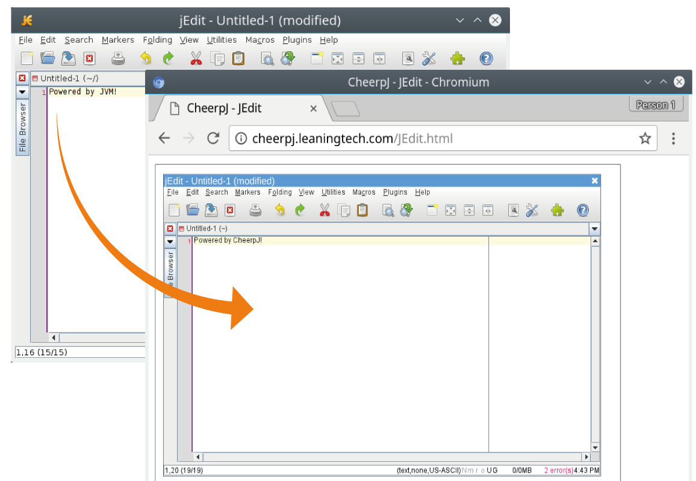

<h1></h1>

CheerpJ is a **drop-in HTML5 replacement** for the JVM, and is compatible with 100% of Java 8, including Swing, reflection and dynamic class loading.

[Documentation](https://labs.leaningtech.com/cheerpj)  
[Issues](https://github.com/leaningtech/cheerpj-meta/issues)  
[Discord server](https://discord.leaningtech.com)  

With CheerpJ, you can:

- Run existing **Java applications** in the browser with no changes
- Include **Java applets** in webpages without legacy plugins
- Migrate **Java Web Start / JNLP** applications to work on modern systems
- Use Java libraries in JavaScript/TypeScript seamlessly

## Licensing

CheerpJ is free for non-commerical use and technical evaluation. See [licensing](https://leaningtech.com/cheerpj-licensing/) for details.
