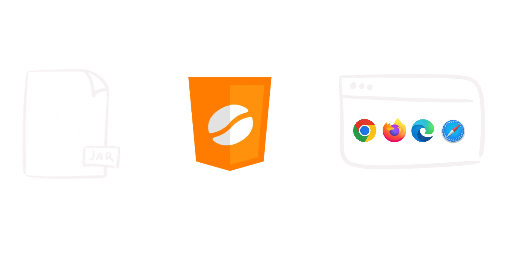

<h1></h1>

[](https://labs.leaningtech.com/cheerpj3)
[](https://discord.leaningtech.com)
[](https://github.com/leaningtech/cheerpj-meta/issues)

CheerpJ is a WebAssembly-based **Java Virtual Machine for the browser**. It
has extensive compatibility with Java 8 and provides a full runtime
environment[^compat] for running Java applications, applets, libraries, and
Java Web Start / JNLP applications in the browser without plugins.

[Documentation](https://labs.leaningtech.com/cheerpj)  
[Examples](examples)  
[Issues](https://github.com/leaningtech/cheerpj-meta/issues)  
[Discord server](https://discord.leaningtech.com)  

```html
<script src="https://cjrtnc.leaningtech.com/4.0/loader.js"></script>
```



## Features

With CheerpJ, you can:

- Run existing [Java applications] in the browser with no changes
- Include [Java applets] in webpages without legacy plugins
- Migrate [Java Web Start / JNLP] applications to work on modern systems
- Use [Java libraries] in JavaScript/TypeScript seamlessly
- Interoperate between Java and JavaScript libraries

CheerpJ is based on a full OpenJDK runtime environment and supports:

- [Networking]
- [Virtualized filesystem]
- [Clipboard]
- Audio
- Printing
- Swing/ AWT

[Get started](https://labs.leaningtech.com/cheerpj3/getting-started)  

## How does CheerpJ work?

CheerpJ is a combination of two components:

1. An optimising Java-to-JavaScript JIT compiler.
2. A full Java SE 8 runtime based on OpenJDK.

Both are written in C++ and are compiled to WebAssembly & JavaScript using [Cheerp](https://labs.leaningtech.com/cheerp).

[Learn more about CheerpJ's architecture](https://labs.leaningtech.com/cheerpj3/explanation/architecture)

## What's unique about CheerpJ?

1. Extensive support for Java 8, including Swing, reflection and dynamic class loading with no manual intervention on the code.
2. CheerpJ works directly on Java bytecode, and does not require access to the Java source code.
3. CheerpJ comes with a full Java SE runtime, inclusive of Swing/AWT. It supports audio, printing, and any other Java SE features. The runtime supports WebAssembly for optimal performance and size.
4. The JavaScript code generated by the CheerpJ JIT is highly optimised and garbage-collectible.
5. CheerpJ enables bidirectional Java-JavaScript interoperability. JavaScript libraries, as well as the DOM, can be called and manipulated from Java. Also, Java modules can be invoked from JavaScript.
6. CheerpJ supports Java multi-threading. In addition, you can create concurrent applications by using Web Workers.

## Licensing

CheerpJ is free for personal use and technical evaluation. See [licensing](https://labs.leaningtech.com/cheerpj3/licensing) for details.

## Demos

Several demos of CheerpJ can be found [here](https://leaningtech.com/demo/).

You can also see CheerpJ in action in [JavaFiddle](https://javafiddle.leaningtech.com/) and [Browsercraft](https://browsercraft.cheerpj.com/).

## Community

CheerpJ is used in production by teams at NASA, Siemens, UBS, and [many others](https://leaningtech.com/case-studies/).

We have a vibrant Discord community where you can ask questions, share your projects, and get community support.

[Join the Discord server](https://discord.leaningtech.com)
[Follow us on X](https://x.com/leaningtech)

[^compat]: CheerpJ has been tested on Oracle Forms, EBS, Swing, AWT, and numerous frameworks and libraries. It should be able to run Java SE applications that you would otherwise need a Java Runtime Environment for.


[Java applications]: https://labs.leaningtech.com/cheerpj3/getting-started/Java-app
[Java applets]: https://labs.leaningtech.com/cheerpj3/getting-started/Java-applet
[Java Web Start / JNLP]: https://labs.leaningtech.com/cheerpj3/getting-started/JNLP
[Java libraries]: https://labs.leaningtech.com/cheerpj3/getting-started/Java-library
[Networking]: https://labs.leaningtech.com/cheerpj3/guides/Networking
[Virtualized filesystem]: https://labs.leaningtech.com/cheerpj3/guides/File-System-support
[Clipboard]: https://labs.leaningtech.com/cheerpj3/reference/cheerpjInit#clipboardmode
